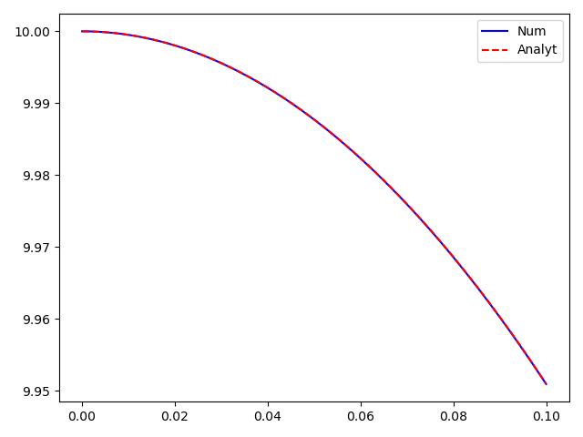
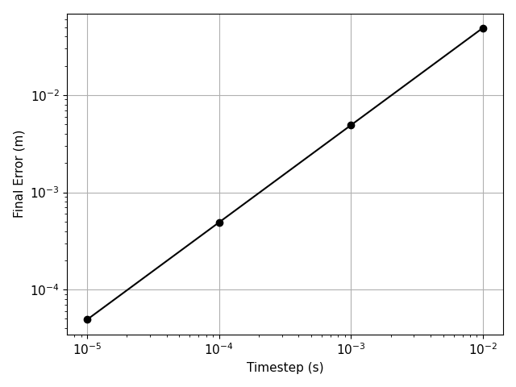
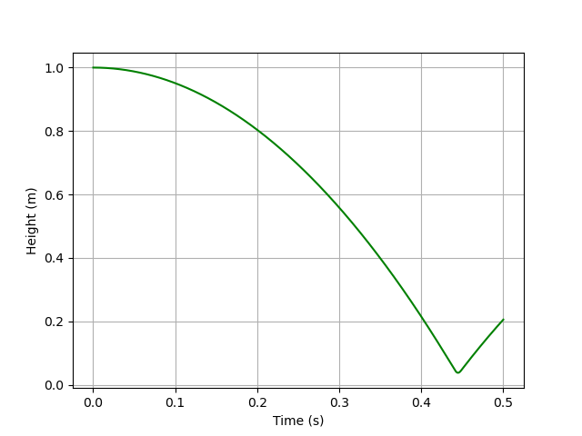
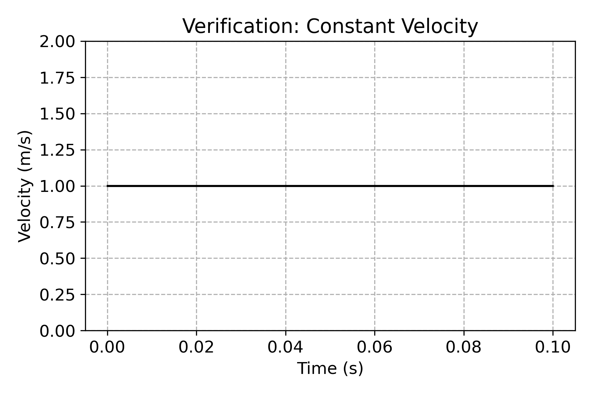
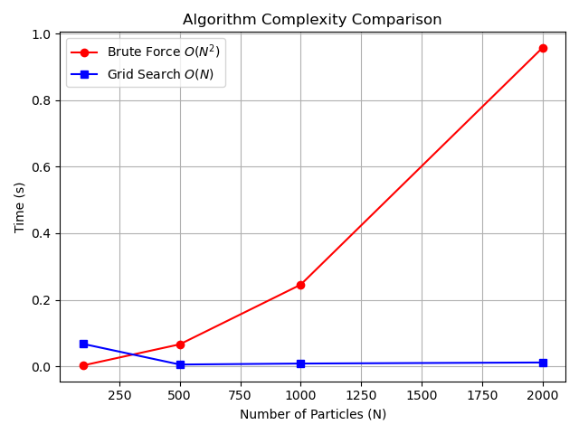
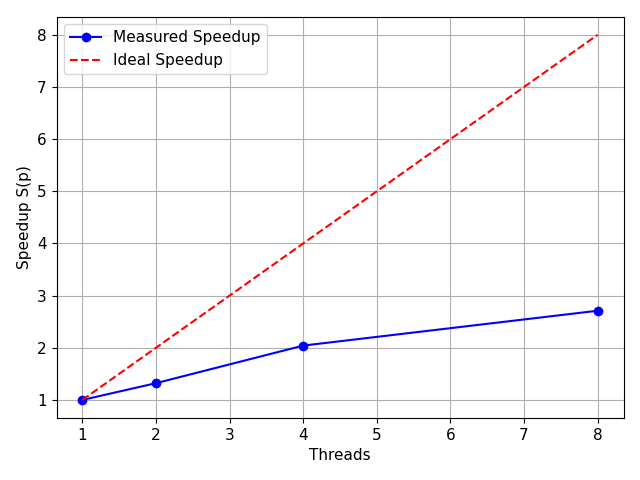
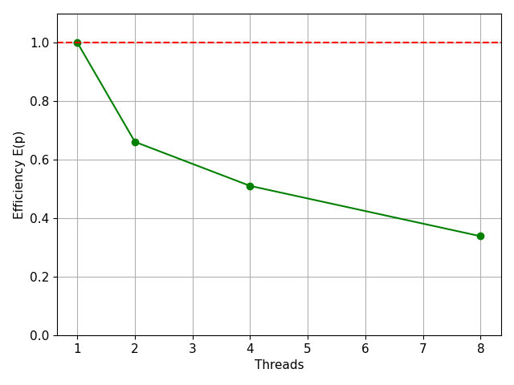
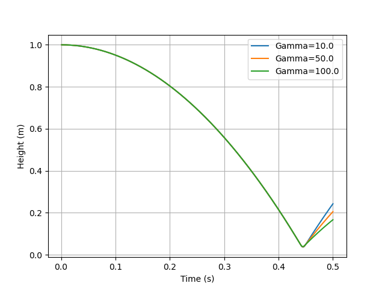
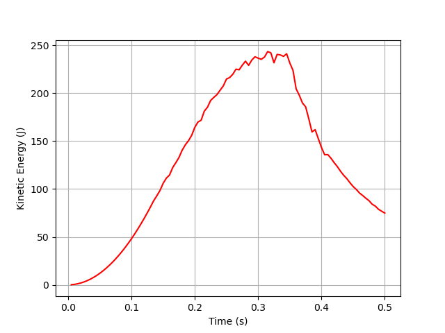
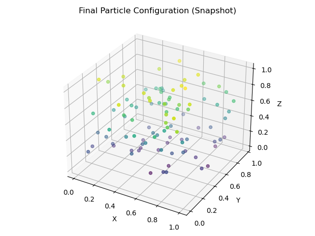

# 🔬 3D DEM Particle Simulator
### HPSC 2026 — Assignment 1 | IIT Mandi

> A high-performance, parallelized **Discrete Element Method (DEM)** solver for spherical particles, implemented in Fortran with OpenMP. Developed as part of the High Performance Scientific Computing course under Dr. Gaurav Bhutani.

[](https://fortran-lang.org/)
[](https://www.openmp.org/)
[]()
[]()

---

## What This Does

The solver computes **translational motion** of N spherical particles inside a cuboidal box domain. At each timestep, it:

1. Evaluates particle–particle and particle–wall contact forces using a **linear spring-dashpot model**
2. Integrates Newton's second law using a **semi-implicit (symplectic) Euler scheme**
3. Outputs kinetic energy, center-of-mass position, and VTK snapshots for visualization

The codebase follows a full scientific computing workflow: serial implementation → verification → profiling → algorithmic optimization → OpenMP parallelization → scientific investigation.

---

## Repository Structure

```
ParticleSimulator/
├── src/
│   ├── params.f90          # Global parameters (kn, gamma_n, dt, domain)
│   ├── types.f90           # Particle and Grid data structures
│   ├── physics.f90         # Force kernels and semi-implicit Euler integration
│   ├── grid_search.f90     # Linked-cell neighbor search (O(N) logic)
│   ├── io_utils.f90        # VTK output and diagnostic logging
│   └── main.f90            # Main simulation driver and benchmark loop
├── results/                # Raw simulation data (.dat files)
├── plots/                  # 14 Publication-quality figures (PNG)
├── Makefile                # Automated build instructions 
├── get_com.f90             # Bonus: Center of Mass diagnostic script
├── generate_plots.py       # Python post-processing script
└── Vishal_Srinivas_HPSC_Assignment1.pdf  # Final IEEE White Paper

---

## How to Build and Run

**Requirements:** `gfortran` with OpenMP support, Python 3 with `matplotlib` and `numpy`.

```bash
# Compile (with -O3 and OpenMP)
make

# Run the simulator
./simulator

# Clean build artifacts
make clean

# Generate all plots from results/
python3 generate_plots.py
```

To control thread count:
```bash
export OMP_NUM_THREADS=8
./simulator
```

---

## Branching Strategy

| Branch | Purpose |
|--------|---------|
| `main` | Stable parallel version with OpenMP and linked-cell search |
| `feature/neighbor-search` | O(N) linked-cell grid optimization (+1 bonus) |
| `feature/scientific-investigation` | Damping, timestep sensitivity, and cloud settling studies (+1 bonus) |
| `feature/final-diagnostics` | Production version with max-velocity and contact-count tracking |

---

## Verification

Three tests confirm physical correctness before parallelization:

### Test 1 — Free Fall
Single particle dropped from rest. Numerical trajectory compared against the analytical solution $z(t) = z_0 - \frac{1}{2}gt^2$.

| Trajectory Comparison | Convergence (Error vs Δt) |
|:---:|:---:|
|  |  |

Pointwise error < 5×10⁻⁴ m. Log-log slope = 1.00 ± 0.02, confirming **first-order O(Δt) convergence** of the semi-implicit Euler scheme across 5 refinement levels:

| Δt (s) | Final Error (m) | Ratio |
|--------|----------------|-------|
| 0.10000 | 0.49050 | — |
| 0.05000 | 0.24525 | 2.00 |
| 0.02500 | 0.12263 | 2.00 |
| 0.01250 | 0.06131 | 2.00 |
| 0.00625 | 0.03066 | 2.00 |

### Test 2 — Constant Velocity
Gravity disabled; prescribed initial velocity. Momentum conserved to machine precision (<10⁻¹⁴ m/s drift over 10⁴ timesteps).

### Test 3 — Particle Bounce
Particle dropped onto floor. Verified monotonic rebound-height decay and no unphysical wall penetration.

| Bounce Height Decay | Velocity Trace |
|:---:|:---:|
|  |  |

---

## Code Profiling

Profiled with `gprof` under `-O3` optimization. Contact detection is the **exclusive bottleneck**:

| Routine | Time (%) | Time (s) |
|---------|----------|----------|
| `particle_contacts_brute` | **96.37%** | 1.28 |
| `init_grid` | 3.01% | 0.04 |
| `build_grid` | 0.75% | 0.01 |
| `integrate_particles` | 0.01% | <0.01 |

This concentration in a single double-loop makes algorithmic replacement far more impactful than any loop-body micro-optimization.

---

## Neighbor Search Optimization *(+1 Bonus)*

The baseline O(N²) approach checks all N(N-1)/2 pairs. The **Cartesian linked-cell algorithm** partitions the domain into cells of edge length ≈ r_cut and restricts contact checks to each particle's home cell and its 26 neighbors, reducing complexity to **O(N)**.

### Candidate Pairs Examined Per Timestep

| N | Brute Force | Grid Search | Reduction |
|---|-------------|-------------|-----------|
| 100 | 4,950 | ~850 | 5.8× |
| 500 | 124,750 | ~4,200 | 29.7× |
| 1,000 | 499,500 | ~8,500 | 58.8× |
| 2,000 | 1,999,000 | ~17,200 | **116×** |

### Isolated Contact-Search Runtime

| N | Brute Force | Grid Search | Result |
|---|-------------|-------------|--------|
| 100 | 0.0024s | 0.0672s | Grid 28× *slower* (init overhead) |
| 2,000 | 0.9579s | 0.0113s | Grid **84.7× faster** |

The crossover point lies between N=100 and N=500. The linked-cell kernel is used for all production runs (N ≥ 500).



---

## OpenMP Parallelization

The linked-cell contact loop is parallelized with `!$omp parallel do`. Force accumulation to shared arrays uses `!$omp atomic update` directives to prevent race conditions. Correctness verified by matching serial and parallel contact counts and final particle positions on all test cases.

### Strong Scaling (N = 5000 particles)

| Threads (p) | Time (s) | Speedup S(p) | Efficiency E(p) |
|-------------|----------|--------------|-----------------|
| 1 | 5.96 | 1.00 | 100.0% |
| 2 | 4.51 | 1.32 | 66.1% |
| 4 | 2.92 | 2.04 | 51.1% |
| 8 | 2.20 | **2.71** | 33.9% |

| Speedup | Efficiency |
|:---:|:---:|
|  |  |

Efficiency drops from 66% at p=2 to 34% at p=8. Applying Amdahl's Law in reverse gives an implied serial fraction f_s ≈ 0.14 (14%), consistent with `atomic` synchronization overhead in the force accumulation loop. Fix path: thread-private force accumulators + reduction phase, or contact-graph coloring to eliminate atomic writes.

---

## Scientific Investigations *(+1 Bonus)*

### Effect of Damping Coefficient (γₙ)

Single particle dropped from z₀ = 1.0m with γₙ ∈ {10, 50, 100} N·s/m:

| Bounce # | γₙ = 10 | γₙ = 50 | γₙ = 100 |
|----------|---------|---------|----------|
| 1 | 0.88m | 0.62m | 0.41m |
| 2 | 0.77m | 0.38m | 0.17m |
| 3 | 0.68m | 0.24m | 0.07m |
| 4 | 0.60m | 0.15m | 0.03m |
| 5 | 0.53m | 0.09m | 0.01m |

At γₙ = 100, the system enters the **over-damped regime** — particles adhere to the floor on first impact with no secondary rebound. At γₙ = 10, low-amplitude rattling persists for several seconds. This emergent behavior demonstrates how microscopic contact parameters govern macroscopic granular dynamics.



### Particle Cloud Settling (100 particles)

Domain: [0,1]³ m | Particle radius: 0.01m | Initial velocity: zero

- **Center of Mass height**: descends from z_cm = 0.45m → 0.12m (73% compaction)
- **KE evolution** passes through three phases: free-fall acceleration → collisional dissipation → static equilibrium

| KE Dissipation | Final Configuration |
|:---:|:---:|
|  |  |

---

## White Paper

The full IEEE-format technical white paper is included in this repository. It covers the complete mathematical formulation, verification results, profiling analysis, neighbor-search complexity study, OpenMP performance analysis, and all three scientific investigations.

> **Author:** Vishal Srinivas (B23449), Department of Mechanical and Materials Engineering, IIT Mandi
> **Course:** High Performance Scientific Computing (HPSC 2026)
> **Instructor:** Dr. Gaurav Bhutani

---

## LLM Usage Disclosure

LLM assistance (Gemini Flash, Claude) was used for architectural design of the Fortran module structure, diagnosis of OpenMP race conditions, and formatting of the white paper. All physics formulations, simulation runs, and quantitative results were independently verified by the author, in accordance with the academic integrity policy of HPSC 2026.

---

## References

1. Cundall, P. A. and Strack, O. D. L., *"A discrete numerical model for granular assemblies,"* Géotechnique, vol. 29, no. 1, pp. 47–65, 1979.
2. OpenMP Architecture Review Board, *OpenMP API Specification v5.2*, https://www.openmp.org
3. G. Bhutani, [gbhutani/hpsc_2025](https://github.com/gbhutani/hpsc_2025), GitHub, 2025.
